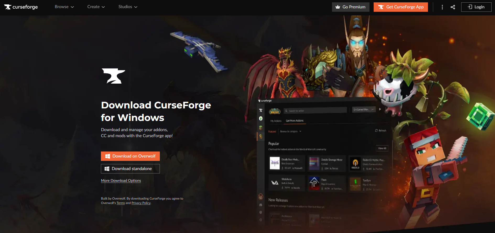
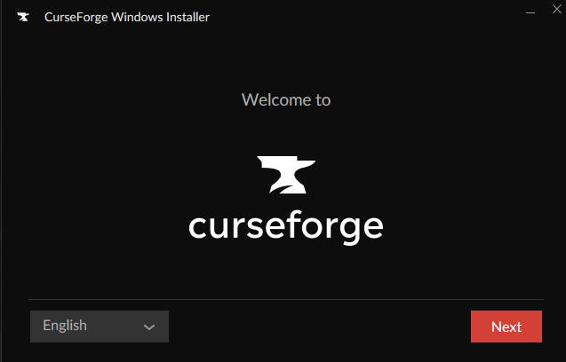
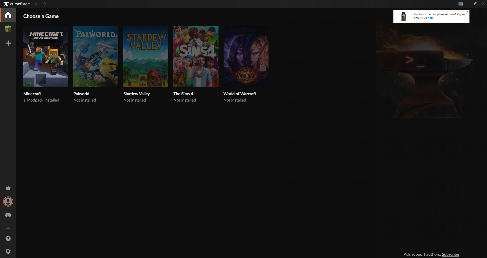
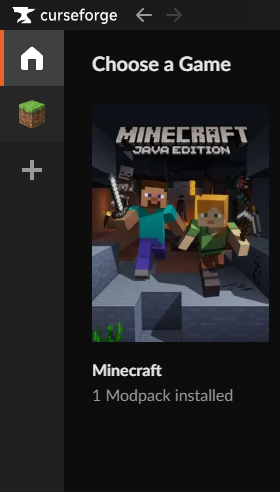
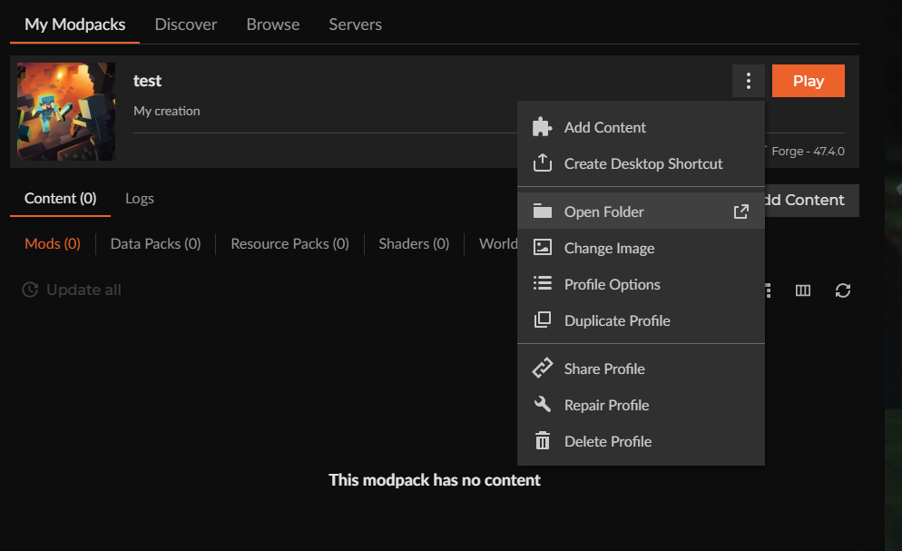
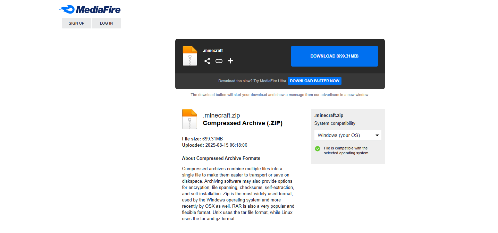

# Modpack Installation Guide

This guide will walk you through installing CurseForge, creating a profile, and adding the downloaded mod and config files.

---

## 1. Install CurseForge
1. Download the CurseForge App:
   https://www.curseforge.com/download/app

   

---

2. Run the installer and follow the setup instructions.

   

3. Once installed, open the CurseForge App.

   
---

## 2. Create a Profile
1. In CurseForge, go to the Minecraft tab.

   

2. Click **"Create"**.
   

3. Choose:
   - A name for your profile (example: *test*).
   - The version of Minecraft required (1.20.1 Forge).

   

---

## 3. Open the Profile Folder
1. Find your newly created profile in CurseForge.

2. Click the three dots (⋮) next to the profile.
3. Select **"Open Folder"**.
   - This will open the folder where your profile’s files are stored keep this window open for the next step.

   

---

## 4. Add the Downloaded Files
1. Download the required files (mods, configs).
   https://www.mediafire.com/file/uyk0ehi7c3kuv54/.minecraft.zip/file

   

2. Extract the .zip files.
   - You can use any file extractor like 7zip or WinRAR.
   - Follow This Guide If You Need Help Extracting Files: https://www.wikihow.com/Unzip-a-File

3. Copy the contents into the correct sub-folders inside your profile folder:
   - **mods** → drag or copy to profile directory.
   - **config** → drag or copy files to profile directory.
   - **options** → drag or copy options.txt file to profile directory.

   https://youtu.be/YXvhKO54hh0
---

## 5. Launch Minecraft And Join The Server
1. Return to CurseForge.

2. Select your profile.

3. Click **"Play"**.

4. Minecraft will start with your mods loaded!
   

5. Join the server by going to multiplayer and adding the server address to direct connect or to server list: `pradelska.dathost.net:17795`

---

## Need Help?
If you get stuck, feel free to reach out.