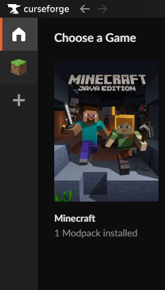
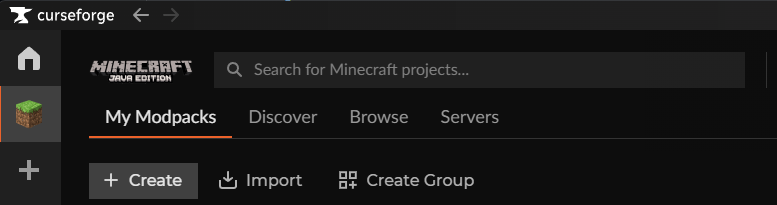
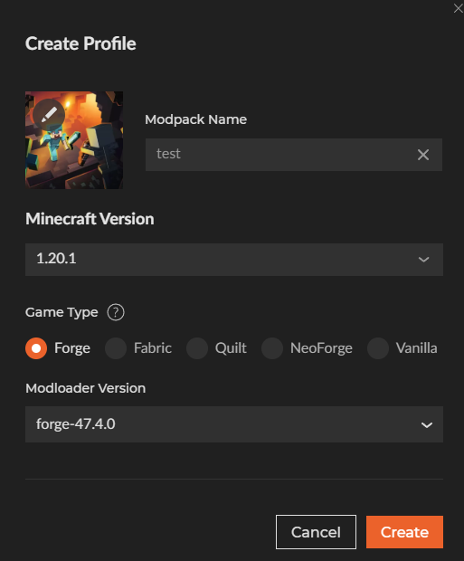
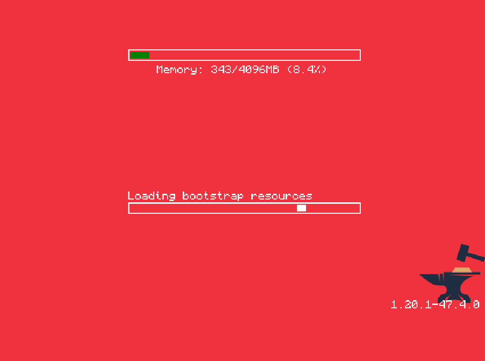

# Modpack Installation Guide

This guide will walk you through installing CurseForge, creating a profile, and adding the downloaded mod and config files.

---

## 1. Install CurseForge
1. Download the CurseForge App:
   https://www.curseforge.com/download/app

2. Run the installer and follow the setup instructions.

3. Once installed, open the CurseForge App.

---

## 2. Create a Profile
1. In CurseForge, go to the Minecraft tab.
 
   
2. Click **"Create Custom Profile"**.
   

3. Choose:
   - A name for your profile (example: *My Modded MC*).
   - The version of Minecraft required.
   - (Optional) The modloader, such as Forge or Fabric, depending on the modpack.
   

---

## 3. Open the Profile Folder
1. Find your newly created profile in CurseForge.
   

2. Click the three dots (⋮) next to the profile.
   

3. Select **"Open Folder"**.
   - This will open the folder where your profile’s files are stored.
   

---

## 4. Add the Downloaded Files
1. Download the required files (mods, configs, or resource packs).
   Example: https://www.mediafire.com/file/rlih436bxn11d0n/mods.zip/file
   

2. Extract the .zip file if it’s compressed.
   

3. Copy the contents into the correct sub-folders inside your profile folder:
   - **mods** → put all `.jar` mod files here.
   - **config** → put all config files here (if included).
   - **resourcepacks** → put resource packs here (if included).
   

---

## 5. Launch Minecraft
1. Return to CurseForge.
   

2. Select your profile.
   

3. Click **"Play"**.
   

4. Minecraft will start with your mods loaded!
   

---

## Need Help?
If you get stuck, feel free to reach out to
